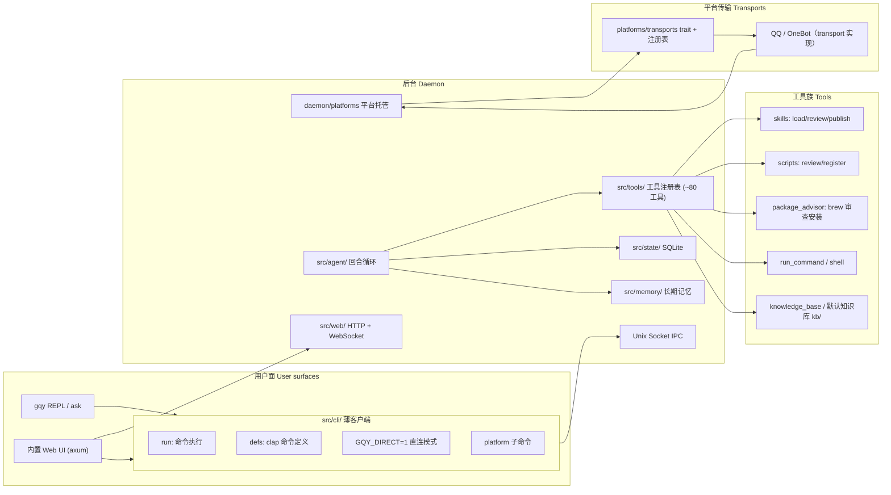

# GQY 架构概览

> 代码结构、模块职责与开发约定。面向想读代码或改代码的人。

## 架构图



## 顶层结构

```
src/
├── main.rs            # 入口：解析 CLI，分发到 cli/
├── cli/               # 命令行前端：REPL、one-shot、daemon、web、platform 启动器
│   ├── defs.rs        # clap 命令与参数定义（Cli/Command/Args）
│   ├── run.rs         # 命令执行（history/kb/memory/skills/reset/wipe…）
│   ├── footer.rs      # REPL 底部状态栏与常量
│   ├── frame_tracker.rs   # 终端帧跟踪与实时输出渲染（原 live）
│   ├── live_input.rs  # REPL 实时输入渲染、原始模式与后台任务视图（原 live2）
│   ├── ipc_client.rs  # CLI 侧 daemon IPC 客户端封装（原 ipc_impl）
│   ├── platform.rs    # gqy platform 子命令（status/list/show/enable/disable/restart）
│   ├── daemon.rs      # 命令调度（IPC 客户端）与 daemon 生命周期
│   └── tests*.rs      # CLI 层测试（按主题分三段）
├── agent/             # 对话智能体：回合、溢出压缩、视觉、工具循环
│   ├── lifecycle.rs   # Agent 生命周期、上下文与状态管理（原 agent_impl）
│   ├── chat_stream.rs # 对话/redo 流式处理（原 agent_impl2）
│   ├── overflow_handling.rs # 上下文溢出处理与视觉描述（原 agent_impl3）
│   └── tool_loop.rs   # 工具调用循环与消息构建（原 agent_impl4）
├── llm/               # LLM 客户端：OpenAI 兼容（DeepSeek 等）
│   └── openai_compatible/  # stream_handlers 流解析 / chat_client 聊天实现 / accumulators
├── config*.rs         # 配置读取与交互式 TUI
│   ├── load_validate.rs    # AppConfig 加载、保存、校验与规范化（原 app_impl）
│   └── models_persona.rs   # 活动模型切换、persona 与系统提示词（原 app_impl2）
├── state/             # 会话/记忆状态存储（SQLite）
│   ├── conversation_db/    # ConversationDb 实现（impl_blocks/helpers/replay/search/*）
│   ├── session_store.rs    # 会话 DB/状态转换工具（原 sessions）
│   ├── session_access.rs   # StateStore 会话/平台绑定与访问授权（原 state_impl）
│   └── turn_ops.rs         # StateStore 轮次、队列与记忆操作（原 state_impl2）
├── memory/            # 长期记忆、日记、好感度（store.rs 实现）
├── daemon/            # daemon 生命周期与第三方平台托管
│   └── platforms.rs   # 平台统一 start/stop/status/restart
├── platforms/         # 平台适配：QQ、终端、Web 事件模型、访问控制
│   └── transports/    # 第三方平台传输抽象：PlatformTransport trait + 注册表 + OneBot 实现
├── web.rs, web/       # 内置 Web 服务（axum）
│   ├── server.rs      # WebUI 服务入口与 QQ 群管理 API（原 sessions_a）
│   ├── ipc_handlers.rs # daemon IPC 连接与 session 命令处理（原 sessions_b）
│   ├── sessions.rs    # 会话 CRUD、IPC turn 与会话 API（原 sessions2）
│   ├── routes.rs      # 路由与静态资源
│   ├── assets_handlers.rs / persona_assets.rs / auth.rs
├── render/            # 终端渲染器（stream_renderer.rs 实现）
├── tools/             # 工具注册表与各工具实现
│   ├── skills.rs      # skill 加载/审查/发布（review_skill/publish_skill）
│   ├── scripts.rs     # 脚本注册/审查（review_script/register_script）
│   ├── skills/        # skill 草稿、安装、资源安全状态（resource_safety.rs）
│   ├── brew.rs        # Homebrew 官方包搜索/详情
│   ├── package_advisor.rs  # Homebrew 包审查与安装
│   ├── man.rs         # man 手册查询
│   ├── subagent_task.rs    # 子代理任务工具（原 tools/task.rs）
│   ├── memory_tools.rs     # 记忆相关工具（原 tools/memory.rs）
│   └── applegamingwiki_query.rs
├── transfer/          # 数据单元/传输定义（export/import）
└── prompts/           # 人格与工作流提示词（brew-review 等）
```

## 关键设计

- **第三方通信平台由 daemon 托管**：QQ/OneBot 等平台的运行与消息处理不再走
  用户面，统一由 `src/daemon/platforms.rs` 管理生命周期；各平台实现
  `PlatformTransport` trait（start/stop/send/receive/status）并经
  `src/platforms/transports/` 注册表注册，预留 QQ 官方、Telegram 等扩展位。
- **模块都保持 1500 行以内**：超长文件按 `mod 子模块` + `use 子模块::*` 拆分，
  impl 块可拆成多段（`impl X {}` 可以出现多次）。
- **人格与逻辑分离**：人格设定、工具使用规则在 `src/prompts/`；工具实现与
  审查流程在 `src/tools/`。
- **上下文即字节**：缓存友好是硬约束，详见 [理念.md](理念.md)。
- **资源安全门**：Skill 与脚本注册都要经过「AI 审查 → 用户确认 → 安装」三阶段，
  审查与安装分属不同轮次（`src/tools/mod.rs` 的 guard 强制）；审查状态落在
  `state/resource-review-state.json`（`src/skills/resource_safety.rs`）。

## 开发约定

1. 提交前跑 `cargo fmt --all --check`；CI 会强制。
2. 不要触碰 `kb/` 目录（用户手动维护）。
3. 发布走 CNB 流水线（`.cnb.yml`）：推送 `v*` 标签触发测试 → 双架构构建 →
   Release 上传（`cnbcool/attachments` 插件）→ Homebrew formula 回写。
   历史 GitHub Actions 见 `.github/workflows/release.yml`（归档）。
